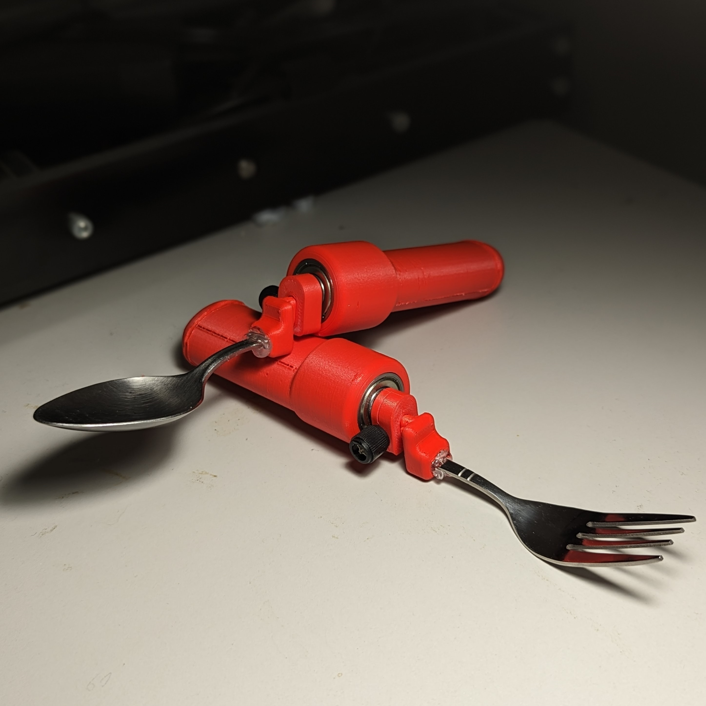

# Spoon Stablizer Support
The Spoon Stabilizer Support is an adapted utensil for people who have difficulties with tremors when eating. It used both passive stabilization and weights to dampen the effect of hand tremors and make it easier to eat.

This device may help people with hand tremors or fine motor challenges due to essential tremors, Parkinson's disease, cerebral palsy, multiple sclerosis, muscular dystrophy, arthritis, stroke, Huntington's diesase, or spinal cord injury.

The design consists of metal cutlery that is cut to length and mounted into a 3D printable handle with some off-the-shelf hardware.

The design was created by [Ian Faulkner](https://www.printables.com/social/380579-ian-faulkner/about). Supporting documentation was created by [Neil Squire Society](https://www.neilsquire.ca/) / [Makers Making Change](https://www.makersmakingchange.com/).

Makers Making Change Assistive Device Library Listing: [https://www.makersmakingchange.com/s/product/spoon-stabilizer-support](https://www.makersmakingchange.com/s/product/spoon-stabilizer-support/01tJR0000009Sd0YAE)

## How to Obtain a Spoon Stablizer Support
### 1. Do it Yourself (DIY) or Do it Together (DIT)

This is an open-source assistive technology, so anyone is free to build it. All of the files and instructions required to build the Spoon Stablizer Support are contained within this repository. Refer to the Maker Checklist below.

### 2. Request a build of this device

If you would like to obtain a Spoon Stablizer Support, you may submit a build request through the [MMC Device Library Page](https://www.makersmakingchange.com/s/product/spoon-stabilizer-support/01tJR0000009Sd0YAE). The requestor is responsible for the cost of materials and any shipping.

### 3. How to build this device for someone else

If you have the skills and equipment to build this device, and would like to donate your time to create the switch for someone who needs it, visit the [MMC Maker Wanted](https://makersmakingchange.com/maker-wanted/) section.

## Getting Started

### 1. Read the Makers Checklist

The Makers Checklist contains the relevant steps to help build the device.

### 2. Order the Off-The-Shelf Components

The [Bill of Materials](/Documentation/Spoon_Stabilizer_Support_BOM.xlsx) lists all of the parts and components required to build the Spoon Stablizer Support.

### 3. Print the 3D Printable components

All of the files and individual print files can be in the [/Build_Files/3D_Printing_Files](/Build_Files/3D_Printing_Files/) folder.

### 4. Assemble the Spoon Stablizer Support

Reference the [Assembly Guide](/Documentation/Spoon_Stabilizer_Support_Assembly_Guide.pdf) for the tools and steps required to build each portion.

## Files
### Documentation
| Document             | Version | Link |
|----------------------|---------|------|
| Design Rationale     | 1.0     | [Spoon_Stabilizer_Support_Design_Rationale](/Documentation/Spoon_Stabilizer_Support_Design_Rationale.pdf)     |
| Maker Checklist      | 1.0     | [Spoon_Stabilizer_Support_Maker_Checklist](/Documentation/Spoon_Stabilizer_Support_Maker_Checklist.pdf)     |
| Bill of Materials    | 1.0     | [Spoon_Stabilizer_Support_Bill_of_Materials](/Documentation/Spoon_Stabilizer_Support_BOM.xlsx)     |
| 3D Printing Guide    | 1.0     | [Spoon_Stabilizer_Support_3D_Printing_Guide](/Documentation/Spoon_Stabilizer_Support_3D_Printing_Guide.pdf)     |
| Assembly Guide       | 1.0     | [Spoon_Stabilizer_Support_Assembly_Guide](/Documentation/Spoon_Stabilizer_Support_Assembly_Guide.pdf)     |
| User Guide           | 1.0     | [Spoon_Stabilizer_Support_User_Guide](/Documentation/Spoon_Stabilizer_Support_User_Guide.pdf)    |
| Changelog            | 1.0     | [Spoon_Stabilizer_Support_Changelog](/Documentation/Spoon_Stabilizer_Support_Changelog.pdf)     |

### Design Files
 - [CAD Files](/Design_Files/CAD_Design_Files/)

### Build Files
 - [3D Printing Files](/Build_Files/3D_Printing_Files)

## Attribution
 - The [Spoon/Fork Stabilizer](https://www.makersmakingchange.com/s/product/spoon-stabilizer-support/01tJR0000009Sd0YAE) was designed by [Ian Faulkner](https://www.printables.com/social/380579-ian-faulkner/about) and made available under a [Creative Commons Attribution-NonCommercial 4.0 ](https://creativecommons.org/licenses/by-nc/4.0/) license.
 - Documentation was created by Neil Squire Society/Makers Making Change.

## License
The Spoon Stablizer Support design is licensed under [Creative Commons Attribution-NonCommercial 4.0 ](https://creativecommons.org/licenses/by-nc/4.0/)

Accompanying material such as instruction manuals, videos, and other copyrightable works that are useful but not necessary to design, make, test, or prepare the Spoon Stablizer Support are published under a Creative Commons Attribution-ShareAlike 4.0 license https://creativecommons.org/licenses/by-sa/4.0/ (CC BY-SA 4.0).

---

## About Makers Making Change

Makers Making Change is a program of [Neil Squire](https://www.neilsquire.ca/), a Canadian non-profit that uses technology, knowledge, and passion to empower people with disabilities.

Makers Making Change leverages the capacity of community based Makers, Disability Professionals and Volunteers to develop and deliver affordable Open Source Assistive Technologies.

 - Website: [www.MakersMakingChange.com](https://www.makersmakingchange.com/)
 - GitHub: [makersmakingchange](https://github.com/makersmakingchange)
 - Twitter: [@makermakechange](https://twitter.com/makermakechange)
 - Instagram: [@makersmakingchange](https://www.instagram.com/makersmakingchange)
 - Facebook: [makersmakechange](https://www.facebook.com/makersmakechange)
 - LinkedIn: [Neil Squire Society](https://www.linkedin.com/company/neil-squire-society/)
 - Thingiverse: [makersmakingchange](https://www.thingiverse.com/makersmakingchange/about)
 - Printables: [MakersMakingChange](https://www.printables.com/@MakersMakingChange)

### Contact Us
For technical questions, to get involved, or to share your experience we encourage you to [visit our website](https://www.makersmakingchange.com/) or [contact us](https://www.makersmakingchange.com/s/contact).
